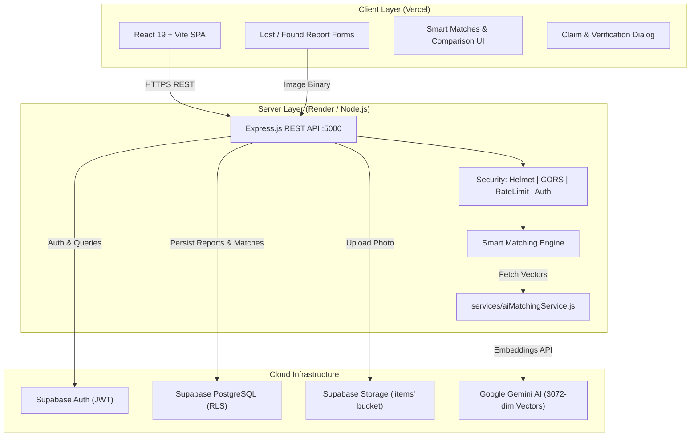

<div align="center">

# 🎓 Campus Lost & Found – Smart Matching
### *AI-Powered Campus Belongings Recovery System*

[](https://react.dev/)
[](https://vitejs.dev/)
[](https://nodejs.org/)
[](https://expressjs.com/)
[](https://supabase.com/)
[](https://ai.google.dev/)
[](https://jestjs.io/)
[](#license)

<br/>

**Campus Lost & Found** is an intelligent full-stack platform designed for university campuses. Combining **Google Gemini AI 3072-dimensional vector embeddings**, multi-criteria spatial-temporal heuristics, and a resilient **Supabase PostgreSQL** backend, the system automatically detects, scores, and connects lost belongings with found item reports in real time.

</div>

---

## 🌟 Highlights & Key Features

- 🧠 **AI-Powered Semantic Matching**: Uses Google Gemini (`gemini-embedding-001`) vector embeddings to recognize that descriptions like *"black HP laptop with red sticker"* and *"black HP notebook having a red sticker"* describe the exact same item.
- 📐 **Multi-Factor Weighted Scoring Engine**: Evaluates Category (20%), Location (25%), Time proximity (15%), Description semantics (30%), Color (5%), and Brand (5%) to calculate a deterministic match confidence score (0–100%).
- 🔔 **Proactive Notifications**: Automatically notifies both the lost item owner and the finder when high-confidence matches ($\ge 75\%$) are detected.
- 🤝 **Claims & Verification System**: Claimers can submit proof of ownership messages and verification photos. Owners or campus administrators can review and approve claims, automatically marking items as resolved.
- 🛡️ **Enterprise-Grade Security**: Row Level Security (RLS) policies, JWT bearer token verification, ownership constraints, rate limiting, and Role-Based Access Control (RBAC) ensuring students can only modify their own items.
- 📸 **Supabase Cloud Storage**: Integrated image upload for lost/found reports and claim proof photos with MIME-type and size validation (5MB max).
- 📊 **Administrative Dashboard**: University staff can track platform metrics, view all active disputes, moderate reports, and suspend unauthorized accounts.

---

## 🏗️ Architecture & Data Flow



---

## ⚖️ Smart Matching Algorithm Breakdown

When a report is submitted, candidate pruning filters out incompatible items (opposite type, active status, compatible category, and within a 30-day window). The engine then evaluates multi-dimensional signals:

| Factor | Weight | Scoring Heuristic |
|---|:---:|---|
| **Category** | **20%** | Exact match = `100%`, Related cluster (e.g. *Electronics $\leftrightarrow$ Accessories*) = `70%`, Incompatible = `0%` |
| **Location** | **25%** | Exact location = `100%`, Nearby campus building = `75%`, Same campus = `50%`, Haversine GPS proximity |
| **Time** | **15%** | 0–30 min = `100%`, 30–60 min = `90%`, 1–2 hr = `75%`, 2–4 hr = `50%`, 4–12 hr = `25%` |
| **Description** | **30%** | Google Gemini `gemini-embedding-001` cosine vector similarity with fallback semantic token Dice coefficient |
| **Color** | **5%** | Exact match = `100%`, Substring/tone overlap = `80%`, Unspecified = `50%`, Different = `0%` |
| **Brand** | **5%** | Case-insensitive match = `100%`, Unspecified = `50%`, Different = `0%` |

$$\text{Final Score} = \sum (\text{Score}_i \times \text{Weight}_i)$$

- **$90\% - 100\%$**: **Strong Match** (Top recommendation)
- **$75\% - 89\%$**: **Likely Match** (Triggers in-app alerts to both users)
- **$60\% - 74\%$**: **Possible Match**
- **$< 60\%$**: Excluded from recommendations

---

## 💻 Tech Stack

- **Frontend**: React 19, Vite, React Router DOM 7, TailwindCSS 4, Lucide Icons, Motion
- **Backend**: Node.js 24, Express 4.21, CORS, Helmet, express-rate-limit, Multer
- **Database & Storage**: Supabase PostgreSQL (5 relational tables with triggers and RLS), Supabase Auth, Supabase Storage
- **AI & ML**: Google Gemini Generative AI SDK (`@google/genai`), `gemini-embedding-001` model
- **Testing**: Jest, Supertest

---

## 🚀 Quickstart Guide

### Prerequisites
- [Node.js](https://nodejs.org/) v20+ 
- A free [Supabase](https://supabase.com) account
- A free [Google AI Studio](https://aistudio.google.com/) Gemini API key

### 1. Clone & Setup

```bash
git clone https://github.com/JawagarVetrivel/Lost-Found.git
cd Lost-Found
```

### 2. Configure Database & Environment

1. In your **Supabase Dashboard**, open the **SQL Editor**, paste the contents of [`server/supabase_schema.sql`](server/supabase_schema.sql), and click **Run**.
2. Create `server/.env`:

```env
PORT=5000
SUPABASE_URL=https://your-project.supabase.co
SUPABASE_SECRET_KEY=your-supabase-service-role-key
SUPABASE_ANON_KEY=your-supabase-anon-key
GEMINI_API_KEY=your-gemini-api-key
FRONTEND_URL=http://localhost:3000
NODE_ENV=development
```

3. Create root `.env`:

```env
VITE_API_URL=http://localhost:5000/api
```

### 3. Run Backend

```bash
cd server
npm install
npm test      # Runs all 37 automated tests
npm start     # Runs on http://localhost:5000
```

### 4. Run Frontend

In the root directory:

```bash
npm install
npm run dev   # Runs on http://localhost:3000
```

Open your browser at **`http://localhost:3000`**.

---

## 📡 REST API Reference

All endpoints return `{ "success": true, "data": { ... } }` or `{ "success": false, "error": { "message", "code" } }`.

| Endpoint | Method | Description | Auth |
|---|:---:|---|:---:|
| `/api/auth/register` | `POST` | Register student / admin | Public |
| `/api/auth/login` | `POST` | Sign in with email & password | Public |
| `/api/auth/me` | `GET` | Get authenticated user profile | Bearer |
| `/api/items` | `GET` | Search & filter lost/found items | Public |
| `/api/items/:id` | `GET` | Get single item report | Public |
| `/api/items/lost` | `POST` | Report lost item (triggers smart matching) | Bearer |
| `/api/items/found` | `POST` | Report found item (triggers smart matching) | Bearer |
| `/api/items/:id` | `PUT` | Update report | Owner / Admin |
| `/api/items/:id` | `DELETE` | Delete report | Owner / Admin |
| `/api/items/:id/status` | `PATCH` | Update status (`active`, `resolved`, `claimed`) | Owner / Admin |
| `/api/upload` | `POST` | Upload photo to Supabase Storage | Bearer |
| `/api/matches` | `GET` | Fetch smart match recommendations | Bearer |
| `/api/matches/:id/dismiss` | `PATCH` | Dismiss match recommendation | Bearer |
| `/api/claims` | `POST` | Submit ownership claim with proof photo | Bearer |
| `/api/claims/my` | `GET` | List user's submitted claims | Bearer |
| `/api/claims/:id` | `PATCH` | Approve/reject claim (resolves item) | Owner / Admin |
| `/api/notifications` | `GET` | List user notifications | Bearer |
| `/api/notifications/:id/read`| `PATCH`| Mark notification as read | Bearer |
| `/api/admin/stats` | `GET` | University platform metrics overview | Admin Only |
| `/api/admin/users` | `GET` | Manage campus users | Admin Only |

*Detailed request and response schemas are documented in [server/README.md](server/README.md).*

---

## 🧪 Automated Testing

```bash
cd server
npm test
```

```text
PASS tests/api.test.js
PASS tests/matching.test.js
PASS tests/aiMatching.test.js

Test Suites: 3 passed, 3 total
Tests:       37 passed, 37 total
Snapshots:   0 total
Time:        4.842 s
```

---

## 🌐 Production Deployment

- **Backend (Render)**: Set Root Directory to `server/`, Build Command to `npm install`, Start Command to `npm start`.
- **Frontend (Vercel)**: Import repo, set `VITE_API_URL=https://your-render-api.onrender.com/api`.
- Step-by-step instructions available in [DEPLOYMENT.md](DEPLOYMENT.md).

---

## 📄 License

Distributed under the MIT License. See `LICENSE` for more information.

---

<div align="center">
Developed by <b><a href="https://github.com/JawagarVetrivel">Jawagar Vetrivel</a></b>
</div>
